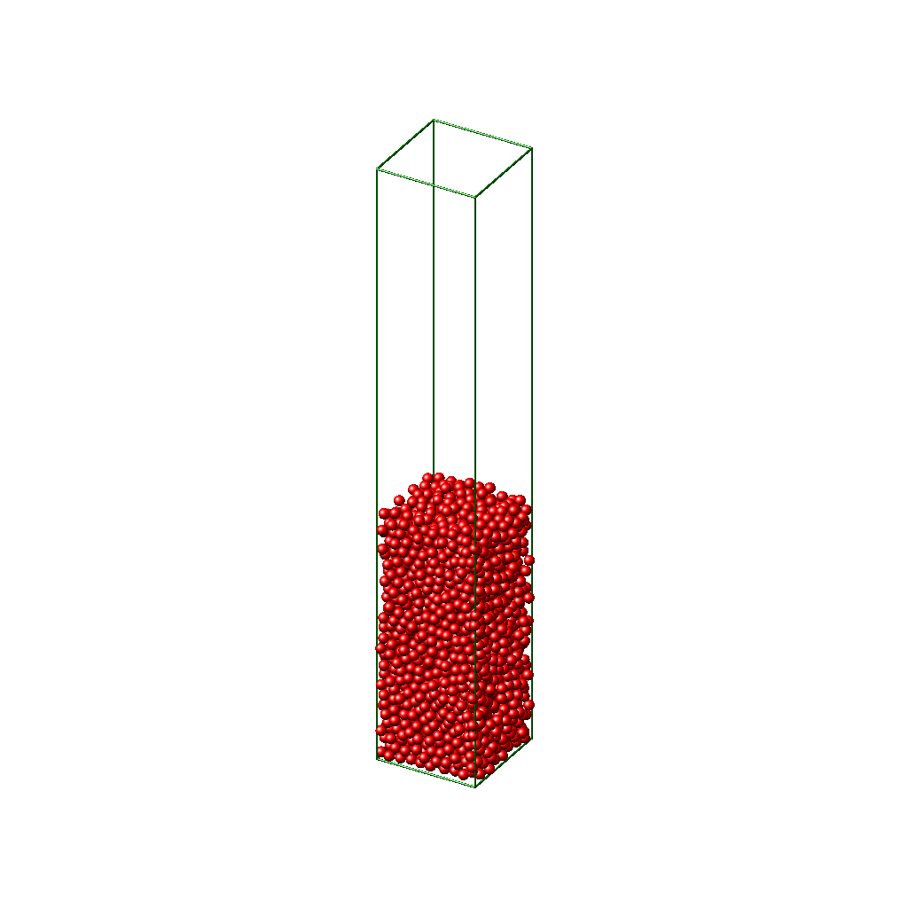

# Sphere-packings
This code is developed for analyzing the data for disordered packings of monodisperse frictionless spheres in three dimensions, which are generated with the molecular dynamics platform LAMMPS. The packings are obtained by pouring N=3000 monodisperse spheres under gravity into a three-dimensional box of side length 10d, where d is the diameter of a sphere. The lateral (x-y plane) boundary conditions are periodic and the box is bounded in the z-direction by a rough surface made of disordered sphere packings at the bottom. The spheres interact with each other via a spring-dashpot model. Simulations are run until the system reaches a static equilibrium when the kinetic energy per particle is small enough. 

This code includes calculation of contact and neighbour numbers, radial distribution function, bond-orientational order parameters, and packing density (using Voronoi tessellation). More details regarding these metrics and disordered packings of particles can be found in [https://pubs.rsc.org/en/content/articlelanding/2021/sm/d1sm00960e#!](https://pubs.rsc.org/en/content/articlelanding/2021/sm/d1sm00960e#!). 

